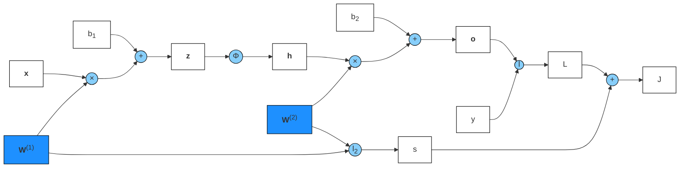

### 4.1 

#### Q1

$$
\begin{equation}
\frac{d}{dx}pReLU(x)=
\left\{
\begin{aligned}
\alpha \quad x<0\\
1 \quad x>0\\
\end{aligned}
\right .
\nonumber
\end{equation}
$$

#### Q2

因为
$$
\begin{equation}
ReLU(x)=
\left\{
\begin{aligned}
x \quad x>0\\
0 \quad x=0\\
0 \quad x<0\\
\end{aligned}
\right .
\nonumber
\end{equation}
$$
$$
\begin{equation}
pReLU(x)=
\left\{
\begin{aligned}
x \quad x>0\\
0 \quad x=0\\
\alpha x \quad x<0\\
\end{aligned}
\right .
\nonumber
\end{equation}
$$
即单个ReLU（或pReLU）函数是连续的分段线性函数，所以多个ReLU（或pReLU）函数的组合仍然是连续的分段线性函数

#### Q3

$$
\begin{align}
tanh(x)+1 &= \frac{1-exp(-2x)}{1+exp(-2x)}+1 \nonumber \\
&= \frac{2}{1+exp(-2x)} \nonumber \\
&= 2sigmoid(2x)\nonumber
\end{align}
$$

#### Q4

小批量数据可能不足以捕获整个数据分布的代表性特征，不同批次的数据可能会以不同的方式缩放，从而导致梯度估计不稳定

### 4.2

#### Q1

略

#### Q2

略

#### Q3

略

#### Q4

略

#### Q5

多个超参数的组合有很多种可能

#### Q6

1. 人工调参（manul tuning）
2. 网格搜索（grid search）
3. 随机搜索（random search）
4. 贝叶斯优化（Bayesian Optimization）

### 4.3

#### Q1

略

#### Q2

略

#### Q3

略

### 4.4

#### Q1

可以，$Loss = \Vert y-\hat{y} \Vert_2 = (y-Xw)^T(y-Xw) = y^Ty-w^TX^Ty-y^TXw+w^TX^TXw = y^Ty-2y^TXw+w^TX^TXw$，得$\frac{dL}{dw} = -2X^Ty+2X^TXw$，令$\frac{dL}{dw} = 0$，得$w=(X^TX)^{-1}X^Ty$

#### Q2

```python
import math
import numpy as np
import torch
from torch import nn
from torch.utils import data
import matplotlib.pyplot as plt

# 生成数据集
max_degree = 20                                                              # 多项式最大阶数
n_train, n_test = 1000, 1000                                                 # 训练集和测试集大小
true_w = np.zeros(max_degree)                                                # 多项式权重
true_w[0:4] = np.array([5, 1.2, -3.4, 5.6])
features = np.random.normal(size=(n_train + n_test, 1))                      # 多项式输入
np.random.shuffle(features)
poly_features = np.power(features, np.arange(max_degree).reshape(1, -1))     # 多项式输出
for i in range(max_degree):
    poly_features[:, i] /= math.gamma(i + 1)                                 # gamma函数是阶乘函数的泛化
labels = np.dot(poly_features, true_w)
labels += np.random.normal(scale=0.1, size=labels.shape)
# NumPy中ndarray类型转换为tensor类型
true_w, features, poly_features, labels = [torch.tensor(x, dtype=torch.float32) for x in [true_w, features, poly_features, labels]]

# 加载数据
def load_array(data_arrays, batch_size, is_train=True):
    dataset = torch.utils.data.TensorDataset(*data_arrays)
    return torch.utils.data.DataLoader(dataset, batch_size, shuffle=is_train)

# 评估损失
def evaluate_loss(net, data_iter, loss):
    loss_all = 0
    nums = 0
    for X, y in data_iter:
        out = net(X)
        y = y.reshape(out.shape)
        l = loss(out, y)
        loss_all = loss_all + l.sum()
        nums = nums + l.numel()
    return loss_all / nums

# 训练一个周期
def train_epoch(net, train_iter, loss, updater):
    # 将模型设置为训练模式
    for X, y in train_iter:
        y_hat = net(X)
        l = loss(y_hat, y)
        updater.zero_grad()
        l.mean().backward()
        updater.step()
# 训练
def train(train_features, test_features, train_labels, test_labels, num_epochs=400):
    loss = nn.MSELoss(reduction='none')
    input_shape = train_features.shape[-1]
    # 不设置偏置，因为我们已经在多项式中实现了它
    net = nn.Sequential(nn.Linear(input_shape, 1, bias=False))
    batch_size = min(10, train_labels.shape[0])
    train_iter = load_array((train_features, train_labels.reshape(-1,1)),batch_size)
    test_iter = load_array((test_features, test_labels.reshape(-1,1)),batch_size, is_train=False)
    trainer = torch.optim.SGD(net.parameters(), lr=0.01)
    train_loss = []
    test_loss = []
    for epoch in range(num_epochs):
        train_epoch(net, train_iter, loss, trainer)
        train_loss.append(evaluate_loss(net, train_iter, loss))
        test_loss.append(evaluate_loss(net, test_iter, loss))
        if epoch == 0 or (epoch + 1) % 500 == 0:
            print(f'轮次{epoch + 1}的训练误差和测试误差为{evaluate_loss(net, train_iter, loss)}和{evaluate_loss(net, test_iter, loss)}')
    return train_loss, test_loss

arr1 = []
arr2 = []
for n in range(600, 1600, 200):
    temp1 = []
    temp2 = []
    for i in range(max_degree):
        va1, va2 = train(poly_features[:n, :(i+1)], poly_features[n:, :(i+1)], labels[:n], labels[n:], num_epochs=1000)
        temp1.append(va1[-1].item())
        temp2.append(va2[-1].item())
    arr1.append(temp1)
    arr2.append(temp2)
arr1 = np.array(arr1)
arr2 = np.array(arr2)
```

#### Q3

会出现特别大的指数值产生特别大的梯度和损失值

#### Q4

几乎不可能，因为数据总是带有一定的噪声

### 4.5

#### Q1

$\lambda$太小的时候，训练精度高，测试精度低，而$\lambda$太大的时候，训练和测试精度都很低

```python
import torch
from torch.utils import data
from torch import nn
import matplotlib.pyplot as plt

# 生成数据集
def synthetic_data(w, b, num_examples):
    X = torch.normal(0, 1, (num_examples, len(w)))
    y = torch.matmul(X, w) + b
    y += torch.normal(0, 0.01, y.shape)
    return X, y.reshape([-1,1])
def load_array(data_arrays, batch_size, is_train=True):
    dataset = torch.utils.data.TensorDataset(*data_arrays)
    return torch.utils.data.DataLoader(dataset, batch_size, shuffle=is_train)
n_train, n_test, num_inputs, batch_size = 20, 100, 200, 5
true_w, true_b = torch.ones((num_inputs, 1)) * 0.01, 0.05
train_data = synthetic_data(true_w, true_b, n_train)
train_iter = load_array(train_data, batch_size)
test_data = synthetic_data(true_w, true_b, n_test)
test_iter = load_array(test_data, batch_size, is_train=False)
# 评估损失
def evaluate_loss(net, data_iter, loss):
    loss_all = 0
    nums = 0
    for X, y in data_iter:
        out = net(X)
        y = y.reshape(out.shape)
        l = loss(out, y)
        loss_all = loss_all + l.sum()
        nums = nums + l.numel()
    return loss_all / nums
def train_concise(wd):
    net = nn.Sequential(nn.Linear(num_inputs, 1))
    for param in net.parameters():
        param.data.normal_()
    loss = nn.MSELoss(reduction='none')
    num_epochs, lr = 100, 0.003
    # 偏置参数没有衰减
    trainer = torch.optim.SGD([
        {"params":net[0].weight,'weight_decay': wd},
        {"params":net[0].bias}], lr=lr)
    train_loss = []
    test_loss = []
    for epoch in range(num_epochs):
        for X, y in train_iter:
            trainer.zero_grad()
            l = loss(net(X), y)
            l.mean().backward()
            trainer.step()
        if (epoch + 1) % 5 == 0:
            print(f'轮次{epoch + 1}的训练误差和测试误差为{evaluate_loss(net, train_iter, loss)}和{evaluate_loss(net, test_iter, loss)}')
        train_loss.append(evaluate_loss(net, train_iter, loss))
        test_loss.append(evaluate_loss(net, test_iter, loss))
    print('w的L2范数：', net[0].weight.norm().item())
    return train_loss, test_loss

arr1 = []
arr2 = []
for lambd in range(10):
    va1, va2 = train_concise(lambd)
    arr1.append(va1[-1].item())
    arr2.append(va2[-1].item())
```

#### Q2

不是最优值，因为真实分布不可能和验证集分布一致，但在验证集上表现最好的性能一般很优秀

#### Q3

$\bold{w} \leftarrow 1-\eta \lambda sgn(\bold{w}) - \frac{\eta}{|\mathcal{B}|}\sum\limits_{i \in \mathcal{B}}\bold{x}^{(i)}(\bold{w}^T\bold{x}^{(i)}+b-y^{(i)})$

#### Q4

矩阵的Frobenius范数

#### Q5

dropout

#### Q6

$argmaxP(\bold{w}|\bold{x}) \leftrightarrow argmaxP(\bold{x}|\bold{w})P(\bold{w}) \leftrightarrow argmin\sum-\ln{P(x_i|w)-\ln{P(w)}}$，假设$P(\bold{w})$服从一定的分布，化简出来是正则化项，若$\bold{w} \sim N(0,\sigma^2)$，则$P(\bold{w}) \sim \exp(-\frac{\Vert \bold{w} \Vert_2}{2\sigma^3})$，即$P(\bold{w})$和正则化联系为$-\ln{P(\bold{w})} = \frac{\Vert \bold{w} \Vert_2}{2\sigma^3} \sim \lambda \Vert \bold{w} \Vert_2$

### 4.6

#### Q1

差别不是很大

```python
import torch
import torchvision
from torch import nn
from torchvision import transforms

def dropout_layer(X, dropout):
    assert 0 <= dropout <= 1
    # 在本情况中，所有元素都被丢弃
    if dropout == 1:
        return torch.zeros_like(X)
    # 在本情况中，所有元素都被保留
    if dropout == 0:
        return X
    mask = (torch.rand(X.shape) > dropout).float()
    return mask * X / (1.0 - dropout)

# 生成数据集
def load_data_fashion_mnist(batch_size, resize=None):
    trans = [transforms.ToTensor()]
    if resize:
        trans.insert(0, transforms.Resize(resize))
    trans = transforms.Compose(trans)
    mnist_train = torchvision.datasets.FashionMNIST(root="../data", train=True, transform=trans, download=True)
    mnist_test = torchvision.datasets.FashionMNIST(root="../data", train=False, transform=trans, download=True)
    return (data.DataLoader(mnist_train, batch_size, shuffle=True, num_workers=4),
            data.DataLoader(mnist_test, batch_size, shuffle=False, num_workers=4))

dropout1, dropout2 = 0.2, 0.5

# 创建网络
net = nn.Sequential(nn.Flatten(),
        nn.Linear(784, 256),
        nn.ReLU(),
        # 在第一个全连接层之后添加一个dropout层
        nn.Dropout(dropout1),
        nn.Linear(256, 256),
        nn.ReLU(),
        # 在第二个全连接层之后添加一个dropout层
        nn.Dropout(dropout2),
        nn.Linear(256, 10))

def init_weights(m):
    if type(m) == nn.Linear:
        nn.init.normal_(m.weight, std=0.01)

net.apply(init_weights);

# 精度计算
# 定义预测正确的数量
def accuracy(y_hat, y):
    if len(y_hat.shape) > 1 and y_hat.shape[1] > 1:
        y_hat = y_hat.argmax(axis=1)
    cmp = y_hat.type(y.dtype) == y
    return float(cmp.type(y.dtype).sum())
def evaluate_accuracy(net, data_iter):
    if isinstance(net, torch.nn.Module):
        net.eval()
    acc_nums = 0     # 正确预测数
    nums = 0         # 预测总数
    with torch.no_grad():
        for X, y in data_iter:
            acc_nums = acc_nums + accuracy(net(X), y)
            nums = nums + y.numel()
    return acc_nums / nums
# 训练
# 训练一个周期
def train_epoch(net, train_iter, loss, updater):
    # 将模型设置为训练模式
    if isinstance(net, torch.nn.Module):
        net.train()
    train_loss = 0         # 训练损失
    train_acc = 0          # 训练准确度
    train_nums = 0         # 训练样本数
    for X, y in train_iter:
        y_hat = net(X)
        l = loss(y_hat, y)
        updater.zero_grad()
        l.mean().backward()
        updater.step()
        train_loss = train_loss + float(l.sum())
        train_acc =  train_acc + accuracy(y_hat, y)
        train_nums = train_nums + y.numel()
    # 返回训练损失和训练精度
    return train_loss / train_nums, train_acc / train_nums
# 训练
def train(net, train_iter, test_iter, loss, num_epochs, updater):
    train_loss_arr = [0.0] * num_epochs
    train_acc_arr = [0.0] * num_epochs
    test_acc_arr = [0.0] * num_epochs
    for epoch in range(num_epochs):
        train_metrics = train_epoch(net, train_iter, loss, updater)
        test_acc = evaluate_accuracy(net, test_iter)
        print(f'轮次{epoch + 1}的训练损失和训练精度为{train_metrics[0]}和{train_metrics[1]}')
        print(f'轮次{epoch + 1}的测试精度为{test_acc}')
        train_loss_arr[epoch] = train_metrics[0]
        train_acc_arr[epoch] = train_metrics[1]
        test_acc_arr[epoch] = test_acc
    return train_loss_arr, train_acc_arr, test_acc_arr

num_epochs, lr, batch_size = 10, 0.5, 256
loss = nn.CrossEntropyLoss(reduction='none')
train_iter, test_iter = load_data_fashion_mnist(batch_size)
trainer = torch.optim.SGD(net.parameters(), lr=lr)
va1, va2, va3 = train(net, train_iter, test_iter, loss, num_epochs, trainer)

x = range(10)
plt.plot(x, va1, x, va2, x, va3)
```

#### Q2

没用dropout的训练效果会更好，但泛化性能不够好，因为发生了过拟合

#### Q3

```python
import torch
from torch import nn

net = nn.Sequential(nn.Linear(64, 256), nn.ReLU(), nn.Dropout(0.2), nn.Linear(256, 64))
X = torch.rand(size=(32, 64))
for i in range(len(net)):
    X = net[i](X)
    if i == 1:
        out = X
    if i == 2:
        drop_out = X
print(torch.var(out))
print(torch.var(drop_out))
```

#### Q4

测试时关注模型的泛化性能

#### Q5

```python
import torch
import torchvision
from torch import nn
from torchvision import transforms

def dropout_layer(X, dropout):
    assert 0 <= dropout <= 1
    # 在本情况中，所有元素都被丢弃
    if dropout == 1:
        return torch.zeros_like(X)
    # 在本情况中，所有元素都被保留
    if dropout == 0:
        return X
    mask = (torch.rand(X.shape) > dropout).float()
    return mask * X / (1.0 - dropout)

# 生成数据集
def load_data_fashion_mnist(batch_size, resize=None):
    trans = [transforms.ToTensor()]
    if resize:
        trans.insert(0, transforms.Resize(resize))
    trans = transforms.Compose(trans)
    mnist_train = torchvision.datasets.FashionMNIST(root="../data", train=True, transform=trans, download=True)
    mnist_test = torchvision.datasets.FashionMNIST(root="../data", train=False, transform=trans, download=True)
    return (data.DataLoader(mnist_train, batch_size, shuffle=True, num_workers=4),
            data.DataLoader(mnist_test, batch_size, shuffle=False, num_workers=4))

dropout1, dropout2 = 0.2, 0.5

# 创建网络
net = nn.Sequential(nn.Flatten(),
        nn.Linear(784, 256),
        nn.ReLU(),
        # 在第一个全连接层之后添加一个dropout层
        nn.Dropout(dropout1),
        nn.Linear(256, 256),
        nn.ReLU(),
        # 在第二个全连接层之后添加一个dropout层
        nn.Dropout(dropout2),
        nn.Linear(256, 10))

def init_weights(m):
    if type(m) == nn.Linear:
        nn.init.normal_(m.weight, std=0.01)

net.apply(init_weights);

# 精度计算
# 定义预测正确的数量
def accuracy(y_hat, y):
    if len(y_hat.shape) > 1 and y_hat.shape[1] > 1:
        y_hat = y_hat.argmax(axis=1)
    cmp = y_hat.type(y.dtype) == y
    return float(cmp.type(y.dtype).sum())
def evaluate_accuracy(net, data_iter):
    if isinstance(net, torch.nn.Module):
        net.eval()
    acc_nums = 0     # 正确预测数
    nums = 0         # 预测总数
    with torch.no_grad():
        for X, y in data_iter:
            acc_nums = acc_nums + accuracy(net(X), y)
            nums = nums + y.numel()
    return acc_nums / nums
# 训练
# 训练一个周期
def train_epoch(net, train_iter, loss, updater):
    # 将模型设置为训练模式
    if isinstance(net, torch.nn.Module):
        net.train()
    train_loss = 0         # 训练损失
    train_acc = 0          # 训练准确度
    train_nums = 0         # 训练样本数
    for X, y in train_iter:
        y_hat = net(X)
        l = loss(y_hat, y)
        updater.zero_grad()
        l.mean().backward()
        updater.step()
        train_loss = train_loss + float(l.sum())
        train_acc =  train_acc + accuracy(y_hat, y)
        train_nums = train_nums + y.numel()
    # 返回训练损失和训练精度
    return train_loss / train_nums, train_acc / train_nums
# 训练
def train(net, train_iter, test_iter, loss, num_epochs, updater):
    train_loss_arr = [0.0] * num_epochs
    train_acc_arr = [0.0] * num_epochs
    test_acc_arr = [0.0] * num_epochs
    for epoch in range(num_epochs):
        train_metrics = train_epoch(net, train_iter, loss, updater)
        test_acc = evaluate_accuracy(net, test_iter)
        print(f'轮次{epoch + 1}的训练损失和训练精度为{train_metrics[0]}和{train_metrics[1]}')
        print(f'轮次{epoch + 1}的测试精度为{test_acc}')
        train_loss_arr[epoch] = train_metrics[0]
        train_acc_arr[epoch] = train_metrics[1]
        test_acc_arr[epoch] = test_acc
    return train_loss_arr, train_acc_arr, test_acc_arr

num_epochs, lr, batch_size = 10, 0.5, 256
loss = nn.CrossEntropyLoss(reduction='none')
train_iter, test_iter = load_data_fashion_mnist(batch_size)
trainer = torch.optim.SGD(net.parameters(), lr=lr, weight_decay=0.3)
va1, va2, va3 = train(net, train_iter, test_iter, loss, num_epochs, trainer)

x = range(10)
plt.plot(x, va1, x, va2, x, va3)
```

#### Q6

有些激活函数在0点处的值不为0，相当于dropout没起到作用

#### Q7

每一层加上$\epsilon \sim N(0,\sigma^2)$

```python

def dropout_layer(X, dropout):
    return X + torch.randn(X.shape)
```

### 4.7

#### Q1

$n \times m$

#### Q2




正向传播
$$
\mathbf{z} = \mathbf{W}^{(1)}\mathbf{x}+b_1 \\
\mathbf{h} = \phi({\mathbf{z}}) \\
\mathbf{o} = \mathbf{W}^{(2)}\mathbf{h}+b_2 \\
L=l(\mathbf{o},y) \\
s=\frac{\lambda}{2}(\Vert \mathbf{W}^{(1)} \Vert_F^2 + \Vert \mathbf{W}^{(2)} \Vert_F^2) \\
J = L+s
$$

反向传播

$$
\frac{\partial{J}}{\partial{\mathbf{W}^{(2)}}} = \frac{\partial{J}}{\partial{L}}\frac{\partial{L}}{\partial{\mathbf{o}}}\frac{\partial{\mathbf{o}}}{\partial{\mathbf{W}^{(2)}}} + \frac{\partial{J}}{\partial{s}}\frac{\partial{s}}{\partial{\mathbf{W}^{(2)}}} = \frac{\partial{L}}{\partial{\mathbf{o}}}\mathbf{h}^T + \lambda\mathbf{W}^{(2)}
$$

$$
\frac{\partial{J}}{\partial{\mathbf{W}^{(1)}}} = \frac{\partial{J}}{\partial{L}}\frac{\partial{L}}{\partial{\mathbf{o}}}
\frac{\partial{\mathbf{o}}}{\partial{\mathbf{h}}}
\frac{\partial{\mathbf{h}}}{\partial{\mathbf{z}}}
\frac{\partial{\mathbf{z}}}{\partial{\mathbf{W}^{(1)}}} + \frac{\partial{J}}{\partial{s}}\frac{\partial{s}}{\partial{\mathbf{W}^{(1)}}} = \frac{\partial{L}}{\partial{\mathbf{o}}}{\mathbf{W}^{(2)}}^T
\frac{\partial{\mathbf{h}}}{\partial{\mathbf{z}}}\mathbf{x}^T+\lambda\mathbf{W}^{(1)}
$$

#### Q3

训练：前向传播和反向传播需要的参数
预测：前向传播需要的参数

#### Q4

需要保存一阶导数。时间上应该至少是两倍。

#### Q5

##### 1

采用数据并行的方法

##### 2

可以加快训练速度，但也会因多卡之间的通信降低训练效率

### 4.8

#### Q1

其他神经网络在权重初始化相同时也会出现对称性

#### Q2

不可以，这样会因为无法打破对称性而永远无法实现网络的表达能力

#### Q3

$|AB|=|A||B|=\lambda_{1a}\lambda_{2a}...\lambda_{ka}\lambda_{1b}\lambda_{2b}...\lambda_{kb}$，其中$\lambda_{ia}$和$\lambda_{jb}$分别为$A$和$B$的特征值  
$|AB|$的特征值$\min{(\lambda_{ia})}\min{(\lambda_{ib})} \leqslant \lambda \leqslant \max{(\lambda_{ia})}\max{(\lambda_{ib})}$  
在矩阵2-范数条件下，条件数$cond(AB)=\sqrt{\frac{\lambda_{max}}{\lambda_{min}}}$，即$\sqrt{\frac{\min{(\lambda_{ia})}\min{(\lambda_{ib})}}{\max{(\lambda_{ia})}\max{(\lambda_{ib})}}} \leqslant cond(AB) \leqslant\sqrt{\frac{\max{(\lambda_{ia})}\max{(\lambda_{ib})}}{\min{(\lambda_{ia})}\min{(\lambda_{ib})}}}$因此可大致判断出矩阵是否病态，梯度是否会因微小扰动出现巨大波动

#### Q4

可以对每一层使用不同的学习率来修正，具体参考论文
You, Y., Gitman, I., & Ginsburg, B. (2017). Large batch training of convolutional networks. arXiv preprint arXiv:1708.03888.

### 4.9

#### Q1

搜索结果发生了变化，用户因此会改变搜索方式，广告商也会因此改变投放策略。

#### Q2

```python
import torch
from torch import nn

# dataset
samples, features = 1000, 2
X_train = torch.randn(samples, features)
X_test_1 = torch.randn(samples, features)
X_test_2 = torch.randn(samples, features) * 5      # 引入协变量偏移
y = torch.ones(samples)

# 构建softmax分类器
net = nn.Linear(2, 2)
loss = nn.CrossEntropyLoss(reduction='mean')
trainer = torch.optim.SGD(net.parameters(), lr=0.1)

def clf_train(X, y, net, loss, trainer, epochs=10):
    for epoch in range(epochs):
        trainer.zero_grad()
        l = loss(net(X), y.long())
        l.backward()
        trainer.step()

def clf_test(X, y, net):    
    _, predicted = torch.max(net(X), dim=1)
    acc = (predicted == y).sum().item() / len(y)
    return acc

# train
clf_train(X_train, y, net, loss, trainer)
# test
train_accuracy = clf_test(X_train, y, net)
print(f"Accuracy on train data: {train_accuracy}")
test_accuracy = clf_test(X_test_1, y, net)
print(f"Accuracy on test data without covariate shift: {test_accuracy}")
test_accuracy = clf_test(X_test_2, y, net)
print(f"Accuracy on test data with covariate shift: {test_accuracy}")
```

#### Q3

```python
import torch
from torch import nn

# dataset
samples, features = 1000, 2
X_train = torch.randn(samples, features)
X_test_1 = torch.randn(samples, features)
X_test_2 = torch.randn(samples, features) * 5      # 引入协变量偏移
y = torch.ones(samples)

# 构建softmax分类器
net = nn.Linear(2, 2)
loss = nn.CrossEntropyLoss(reduction='mean')
trainer = torch.optim.SGD(net.parameters(), lr=0.1)

def clf_train(X, y, net, loss, trainer, epochs=10):
    for epoch in range(epochs):
        trainer.zero_grad()
        l = loss(net(X), y.long())
        l.backward()
        trainer.step()

def clf_test(X, y, net):    
    _, predicted = torch.max(net(X), dim=1)
    acc = (predicted == y).sum().item() / len(y)
    return acc

clf_train(X_train, y, net, loss, trainer)

# 协变量偏移纠正前
train_accuracy = clf_test(X_train, y, net)
print(f"Accuracy on train data: {train_accuracy}")
test_accuracy = clf_test(X_test_1, y, net)
print(f"Accuracy on test data without covariate shift: {test_accuracy}")
test_accuracy = clf_test(X_test_2, y, net)
print(f"Accuracy on test data with covariate shift: {test_accuracy}")

# 协变量偏移纠正
# Step1: 生成二元分类训练集
X = torch.cat([X_train, X_test_2], dim=0)
y_set = torch.cat([torch.full((samples,), -1), torch.full((samples,), 1)], dim=0)

# Step2: 定义对数几率回归模型并训练二元分类器
class LogisticRegression(nn.Module):
    def __init__(self, features):
        super(LogisticRegression, self).__init__()
        self.linear = nn.Linear(features, 1)

    def forward(self, x):
        return self.linear(x)

net = LogisticRegression(features)
loss1 = nn.BCEWithLogitsLoss()
trainer = torch.optim.SGD(net.parameters(), lr=0.1)

def train_model(X, y_set, net, loss1, trainer, epochs=10):
    for epoch in range(epochs):
        trainer.zero_grad()
        l = loss(net(X).view(-1), y_set.float())
        l.backward()
        trainer.step()

train_model(X, y_set, net, loss, trainer)

# Step3: 计算权重βi
def compute_weights(net, X, c=5):
    with torch.no_grad():
        weight = torch.min(torch.exp(net(X)), torch.tensor(c).float())
    return weight

weight = compute_weights(net, X)

# Step4: 使用权重βi对训练数据进行加权训练
net = nn.Linear(2, 2)
loss2 = nn.CrossEntropyLoss(reduction='mean')
trainer = torch.optim.SGD(net.parameters(), lr=0.1)

def clf_train_weight(X, y, net, loss, trainer, epochs=10):
    for epoch in range(epochs):
        trainer.zero_grad()
        l = torch.mean(weight * loss(net(X), y.long()))
        l.backward()
        trainer.step()

clf_train_weight(X_train, y, net, loss2, trainer)

# 协变量偏移纠正后
train_accuracy = clf_test(X_train, y, net)
print(f"Accuracy on train data: {train_accuracy}")
test_accuracy = clf_test(X_test_1, y, net)
print(f"Accuracy on test data without covariate shift: {test_accuracy}")
test_accuracy = clf_test(X_test_2, y, net)
print(f"Accuracy on test data with covariate shift: {test_accuracy}")
```

#### Q4

1. 数据不平衡。模型对少数类别的识别可能会受限。
2. 特征选择。不合理的特征选择会导致在真实数据上性能的下降。
3. 模型选择和复杂度。欠拟合和过拟合都会导致泛化能力下降。