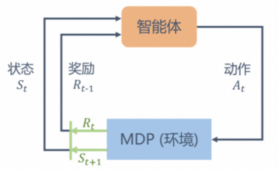

# 强化学习

智能体**感知**环境状态，**决策**采取动作，环境根据智能体动作生成**奖励**并产生新的状态，然后再开始下一轮。

## 1.基本概念

强化学习的数学描述——Markov决策过程 $<S,A,P,r,\gamma>$

- $S$ 是状态集合
- $A$ 是动作集合
- $\gamma$ 是折扣因子，取值范围为[0,1)，接近1更关注长期奖励，接近0更关注短期奖励
- $r(s,a)$ 是奖励函数，此时奖励同时取决于状态 $s$ 和动作 $a$ ，当奖励只取决于状态 $s$ 时，奖励函数退化为 $r(s)$
- $P(s'|s,a)$ 是状态转移函数，表示状态 $s$ 在执行动作 $a$ 后到达状态 $s'$ 的概率

回报 $G_t=R_t+\gamma R_{t+1}+\gamma^2R_{t+2}+...=\sum_{k=0}^{\infty}\gamma^kR_{t+k}$ ，表示从 $t$ 时刻开始直到终止时所有奖励之和

价值 $V(s)$，表示在状态 $s$ 获得的期望回报

贝尔曼方程

$$
\begin{align*}
V(s)
&= \mathbb{E}[G_t|S_t=s] \\
&= \mathbb{E}[R_t+\gamma R_{t+1}+\gamma^2R_{t+2}+...|S_t=s] \\
&= \mathbb{E}[R_t+\gamma(R_{t+1}+\gamma R_{t+2}+...)|S_t=s] \\
&= \mathbb{E}[R_t+\gamma G_{t+1}|S_t=s] \\
&= \mathbb{E}[R_t+\gamma V(S_{t+1})|S_t=s] \\
&= r(s)+\gamma \sum_{s'\in S}p(s'|s)V(s')
\end{align*}
$$

写成矩阵形式

$$V=R+\gamma PV$$

可得价值函数解析解

$$V=(I-\gamma P)^{-1}R$$

策略：$\pi(a|s)=P(A_t=a|S_t=a)$，表示在状态 $s$ 采取动作 $a$ 的概率

状态价值函数：$V^{\pi}(s)=\mathbb{E}_{\pi}[G_t|S_t=s]$，表示在状态 $s$ 遵循策略 $\pi$ 获得的期望回报，其贝尔曼方程为

$$
\begin{align*}
V^{\pi}(s)
&= \mathbb{E}[R_t+\gamma V^{\pi}(S_{t+1})|S_t=s] \\
&= \sum_{a \in A}\pi(a|s)(r(s)+\gamma \sum_{s'\in S}p(s'|s,a)V^{\pi}(s'))
\end{align*}
$$

动作价值函数：$Q^{\pi}(s,a)=\mathbb{E}_{\pi}[G_t|S_t=s,A_t=a]$，表示从状态 $s$ 遵循策略 $\pi$ 执行动作 $a$ 得到的期望回报

状态价值函数和动作价值函数关系

- 在使用策略 $\pi$ 中，状态 $s$ 的价值等于在该状态下基于策略 $\pi$ 采取所有动作的概率与相应的价值相乘再求和的结果

$$V^{\pi}(s)=\sum_{a \in A}\pi(a|s)Q^{\pi}(s,a)$$

- 使用策略 $\pi$ 时，状态 $s$ 下采取动作 $a$ 的价值等于即时奖励加上经过衰减后的所有可能的下一个状态的状态转移概率与相应的价值的乘积：

$$Q^{\pi}(s,a)=r(s,a)+\gamma\sum_{s'\in{S}}P(s'|s,a)V^{\pi}(s')$$

其贝尔曼方程为

$$
\begin{align*}
Q^{\pi}(s,a)
&= \mathbb{E}[R_t+\gamma Q^{\pi}(S_{t+1},A_{t+1})|S_t=s,A_t=a] \\
&= r(s,a) + \gamma \sum_{s'\in S}p(s'|s,a) \sum_{a' \in A}\pi(a'|s')Q^{\pi}(s',a')
\end{align*}
$$
